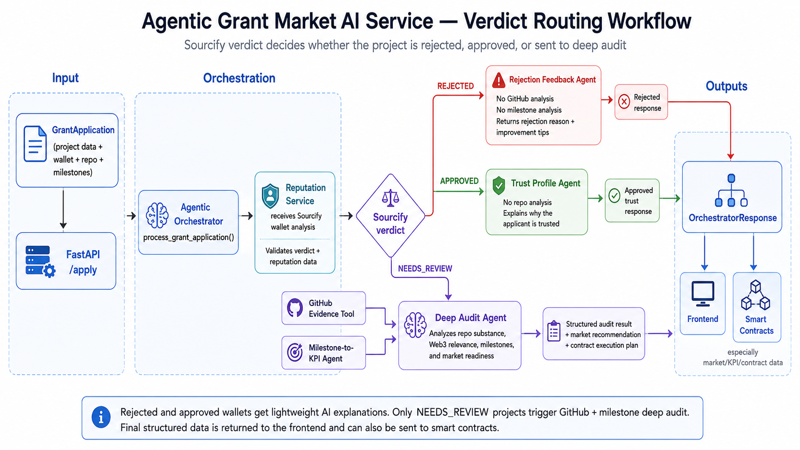

# ethprague2026
## The initial CrewAI agent definitions were replaced by a deterministic service-based agent pipeline for MVP stability.

The system currently generates Umia-ready market parameters. Real deployment is the next integration step. Agentic workflows are implemented in the services layer, while tools expose external capabilities such as GitHub and Sourcify evidence collection.

src/
  api/          FastAPI endpoints
  agents/       agent roles / legacy prompts / orchestration definitions
  services/     business logic and agentic workflows
  tools/        external capabilities used by agents
  schemas/      Pydantic request/response contracts
  core/         settings and configuration

The orchestrator is verdict-driven.

Sourcify reputation analysis returns one of three high-level outcomes:

- `REJECTED`: the applicant does not proceed to repository analysis. The system returns a lightweight AI-generated rejection explanation and improvement suggestions.
- `APPROVED`: the applicant is considered trusted based on on-chain reputation. The system returns a trust profile explaining why the wallet is credible.
- `NEEDS_REVIEW`: the applicant enters the full deep audit path, where GitHub evidence and milestones are analyzed before market readiness is decided.

Current AI pipeline:
1. Reputation service validates Sourcify output.
2. GitHub tool collects repository evidence.
3. Milestone agent evaluates roadmap KPI quality.
4. Deep audit service produces final decision and contract_execution_plan for backend/blockchain integration.

CrewAI roles are kept as legacy/future reference but are not part of the active execution path.

Sourcify reputation result
        ↓
verdict == REJECTED
        ↓
return light AI rejection explanation
NO GitHub analysis
NO milestone analysis
NO deep audit

verdict == NEEDS_REVIEW
        ↓
run GitHub Evidence Tool
run Milestone-to-KPI Agent
run Deep Audit Agent

verdict == APPROVED
        ↓
return trust profile / positive AI explanation
NO GitHub analysis unless you explicitly want optional verification

REJECTED → cheap path, fast frontend response, no GitHub clone
APPROVED → cheap path, trust explanation, no unnecessary analysis
NEEDS_REVIEW → expensive path, GitHub + milestones + Gemini audit

1. repo_url из CLI
2. fake application: Buk Reservation System
3. fake milestones про Sepolia contract + 50 wallet interactions
4. fake Sourcify reputation score 0.42